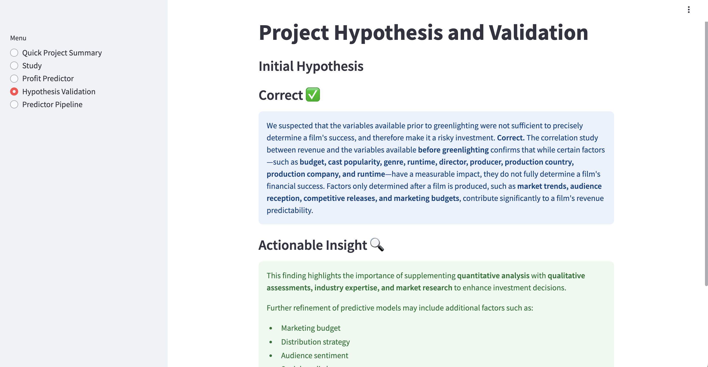

# 

# Film Hit Prediction
A web application that predicts film revenue and profit prior to production using machine learning.

## Live Demo
The application is deployed and accessible at:
[Film Hit Prediction](https://film-hit-prediction.onrender.com/)

## Dataset Content
The "TMDB 5000 Movie Dataset", sourced from Kaggle, was used as the foundation for our analysis. We developed a user story tailored to the needs of 08Industries, a film investment company, where predictive analytics could be applied to support data-driven decision-making.

The dataset contains information on 5,000 films, split into two separate files. The first dataset consists of 4 columns, representing key movie details such as id, title, cast, and crew. The second dataset provides a more comprehensive view with 20 columns, covering attributes such as budget, genres, homepage, id, keywords, original_language, original_title, overview, popularity, production_companies, production_countries, release_date, revenue, runtime, spoken_languages, status, tagline, title, vote_average, and vote_count. Together, these datasets provide a holistic overview of the films included in the dataset. A key limitation of the dataset is that it was last updated eight years ago, meaning the data may not accurately reflect current industry trends and market conditions.

## Business Requirements

08 Indusrties, an film investment company wants to invest in a film. As investment in films happens prior in greenlight, 08 Industries wanted to apply predictive analytics to try and assess the safety of their investmnet.

1 - 08 Industires are interested in discovering how the variables of the project known before greenlight correlate to the film revenue, to assess the safety of investing in films.

2 - 08 Industries is interested in predicting the revenue and profit from the variables of the film, avaialble prior to the greenlight. 

## User Stories

---

#### User story 1 - Create Dashboard (BR1,BR2)

* As a User I want to be able to access an easy-to-use dashboard that showcases graphs and other relevant information. The dashboard is divided up into 5 different pages, Project Summary, Feature Correlation, Revenue Predictor, Project Hypotheses and Validation and ML Movie Revenue Preditiction Pipeline. You can find a detailed outline of the pages below.

#### User Story 2 - Dataset Access (BR1, BR2)

* As a Software Developer, I aim to obtain a dataset that will enable me to build this project and perform essential tasks related to data manipulation and visualization. The dataset originates from Kaggle.

#### User Story 3 - Data Cleaning (BR1,BR2)

* As a Software Developer, I must clean the data in order to handle missing values and remove errors and inconsistencies. I also need to encode the string data and filter out the irrelevant data to the requiered parameters prior to greenlighting, so that I have a dataset to work with for the project. 

#### User Story 4 - Automated Data Loading (BR1, BR2)

* As a Software Developer, I plan to utilize automated data loading by importing CSV files into my Jupyter Notebooks. This approach is beneficial when working with multiple datasets or needing to load data repeatedly.

#### User Story 5 - Data Visualization (BR1)
* As a User, I want data to be represented through graphs, scatterplots, and other visualizations. This will enhance understanding and make the information more visually appealing for the client.

#### User Story 6 - Cross Industry Standard Process for Data Mining (CRISP-DM) (BR1, BR2)

* As a Software Developer, I will follow the CRISP-DM methodology to guide me through each stage of the project, from business understanding to deployment.

#### User Story 7 - Validate Hypothesis (BR1, BR2)

* As a User, I want to understand the project hypotheses and the methods used to validate them.

#### User Story 8 - Feature Engineering (BR1, BR2)

* As a Software Developer, I want to perform Feature Engineering on the data to transform raw data into a format that enhances the ability of machine learning models to recognize patterns, relationships, and trends.

#### User Story 9 - Business Requirements (BR1, BR2)

* As a Client, I want to ensure that the established Business Requirements are fulfilled and that the implemented features function correctly to meet those requirements.

#### User Story 10 - Deployment (BR1, BR2)

* As a Software Developer, I must deploy the website to Heroku and ensure that it runs smoothly without any errors.
---

## Hypothesis and how to validate?

* We suspect that the variables available prior to greenlighting are insufficient to precisely determine a film's success, making it a risky investment.

* We will validate this through a thorough correlation study between revenue and the variables available before greenlighting.

* We will validate the model's predictability by comparing its predictions against actual outcomes in a holdout validation set, calculating key performance metrics such as accuracy, precision, recall, and mean squared error (MSE) for regression tasks or confusion matrix analysis for classification tasks.  

## The rationale to map the business requirements to the Data Visualizations and ML tasks

#### Business Requirement 1: Data Visualization and Correlation Study

* We will import, examine, preprocess, engineer features, and assess the data associated with the film project under consideration.

* We will perform an analysis to explore the relationships between variables and their influence on film revenue.

* We will utilize graphical data visualizations to confirm hypotheses and address our business requirements.

For more information, please visit the "Film Success Study" notebook.

#### Business Requirement 2: Regression Pipeline

* We want to be able to predict the revenue and profit for a film project before greenlight.

* We built and trained a regression model to help predict the revenue and profit. 

* We want to find out R2 score and Mean Absolute Error . (See screenshots).

### Machine Learning Business Case

* We need to develop a machine learning model to estimate a film's revenue and profit. For this project, we chose a Regression Model. A Regression Model is a type of model that establishes a relationship between one or more independent variables and a dependent variable. In this scenario, the dependent variable is the revenue.

* Our goal is to deliver an application to the client that can forecast a film's revenue before it receives greenlight approval. This will enhance their ability to make informed and safer investment decisions.

* The model's success criteria are defined as follows: achieving a minimum R² score of 0.75 on both the training and test sets. Additionally, the model will be considered unsuccessful if, after a period of 12 months, its ability to accurately predict film revenue deteriorates.

* As mentioned above, the target variable is revenue.

## Dashboard Design
* The dashboard contains a very simple layout. It contains 5 pages, Project Summary, Feature Correlation, Movie Revenue Predictor, Project Hypothesis and Validation and ML Revenue Prediction Pipeline.

* The prediction pipeline page consists of four main sections: Pipeline Overview, Data Cleaning Pipeline, Feature Engineering Pipeline, and Cast & Crew Engineering Pipeline. Each of these sections is further broken down into multiple widgets, which help visualize and manage the different stages of the pipeline efficiently.

Page 1 -  Project Summary: This page provides an overview of the project, including details about the data source, a dictionary explaining the key terms used, a link to the README file, and an outline of the business requirements.

Page 2 - Film Success Study Page: This page presents a correlation analysis between the variables available prior to greenlighting and a film's revenue. It highlights key observations and provides visual representation of the studied correlations, which users can view by selecting checkboxes.

Page 2 - An example of the various visual representations of the correlation studies available through the checkboxes on the Film Success Study page. 

Page 3 - Revevenue Predictor: This is the page where you can run your predictive analysis and predict the Revenue and Profit of the film before greenlight.

Page 4 - Project Hypothesis and Validation: You can view the project's hypothesis' and validation here.

Page 5 -  Movie Revenue Prediction Pipeline Overview: This section provides an overview of the entire prediction pipeline, which is divided into four sections (detailed below). On the overview page, users can view the model's performance scores along with visual representations of the validation metrics, offering insights into the model's effectiveness and accuracy.

Page5 - Movie Revenue Prediction Pipeline Overview: One of the numerous visual interprations of the model performance.

Page 6 -  Cleaning pipelne page, widget 1: You can view the pipeline steps here.

Page 7 -  Cleaning pipelne page, widget 2: You can view the pipeline transformation details here.

Page 8 - Engineering Pipeline page, widget 1: You can view the engineering pipeline components here.

Page 9 - Engineering Pipeline, widget 2: You can view the pipeline's detailed metrics.

Page 10 - Cast & Crew Engineering Pipeline: You can view the metrics for the cast egineering here.

Page 11 - Directors Engineering Pipeline: You can view the metrics for the directors here.

Page 12 - Producers Engineering Pipeline: You can view the metrics for the producers here.

Page 13 - Writers Engineering Pipeline: You can view the metrics for the writers here.

See below for visual interpration of the model performance graphs on the dashboard:

## Unfixed Bugs

* No bugs

## Deployment
### Render

* Create a Render accout if you haven't done so already.

* Create a new app, give it a unique name and select your region, build command, start command and enviroment variable.

* Connect to GitHub (you might be asked to confirm login through the mobile app if you have it downloaded).

* Select the appropriate branch from which you want to deploy the project from.

* Deploy the project. Keep an eye on the build log if the deployment fails, this will suggest any changes that need to be made in order to deploy successfully.

## Main Data Analysis and ML Libraries

* Streamlit: We utilized Streamlit to develop the dashboard. Streamlit makes building applications simple and is especially beneficial for data-driven projects and machine learning models. Additionally, it's a great option for those with limited front-end development experience.

Kaggle: This is where the dataset we used for Heritage Housing Issues was used. The link can be found above and was granted to us by Code Institute.

Git: This was used for version control. You can write a commit message using the following commands: -> **"git add ." -> "git commit -m message" -> "git push". It's good practice to keep commit messages under 50 characters.

* Pandas: We utilized this library for data manipulation and analysis. It offers two primary data structures: Series and DataFrames, with DataFrames being extensively used throughout this project.

* NumPy: We used this to handle arrays and store values efficiently. It is a robust library designed for numerical computing in Python.

* Matplotlib: This was used for generating graphs for data visualization.

* Scikit-learn: This was used for  predictive modelling and model evaluation.

* Seaborn: This was particularly useful for the visualization of data on Streamlit. It implements attractive and styled visuals.

* Feature-engine: This library is essential for the Feature Engineering notebook. It also offers transformer classes.

* Python: The main programming language used for this project.

## Credits 

* The dataset was accessed on Kaggle through Code Institute.

